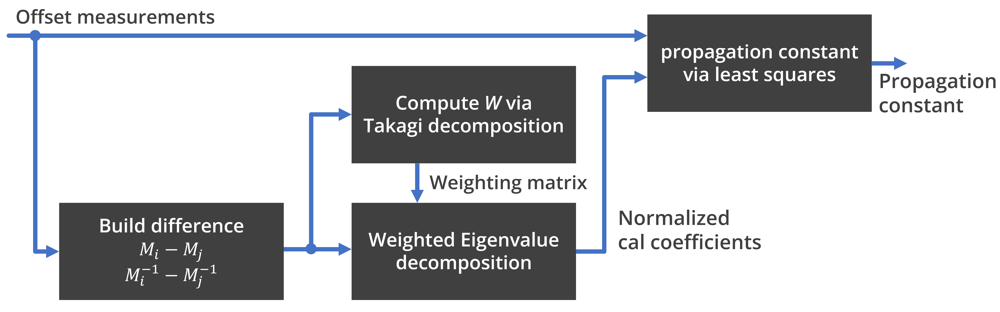

# Multinetwork method for measuring propagation constant

A method for measuring the propagation constant of a single transmission line using measurements from a multi-offset network along the line. The code in this repository is based on the work presented in [1].

## Basic principle

So, the general idea is that we have a transmission line of some length. In addition, we have the possibility to slide an object on this transmission line. We call this object the unknown network. Below is a sketch of how the measurement setup looks like.


*Illustration of network offset on a transmission line. The network can move on both direction.*

Although the network's S-parameters are not known, it should fulfill some basic criteria in the frequency range we are interested in:

1. It must exhibit both reflection and transmission. That is, $S_{ij}>0$ at all frequency points considered.
2. Its S-parameter shouldn't change when it is moved.
3. It should not cause the generation of additional modes on the transmission line or introduce resonance.
4. If above points are fulfilled, the network may be asymmetric and/or non-reciprocal (no structural requirements).

Regarding the first condition. At best, we want the S-parameters of the network to satisfy the condition $|S_{11}S_{22}|/|S_{21}S_{12}|=1$, but this may not be possible without violating points 2 and 3. In general, as long as $S_{ij}>0$, the math should work fine, but the uncertainty can be improved by minimizing the error: $(|S_{11}S_{22}|/|S_{21}S_{12}|-1)$.

Given we have a proper sliding network, we collect measurements from an uncalibrated VNA for different offsets of the network. We need at least 3 offsets to have a valid set of measurements. The more offsets, the wider the bandwidth you can cover. You can use [`test_length.py`][test_lengthpy] to test your chosen offsets if they support your frequency range.

One last thing to note is the convention for the direction of movement of the network. In my code, I used the convention that moving to the right has a positive offset, while moving to the left has a negative offset. In my example measurement, I basically set the reference (zero offset) to the far left of the transmission line and moved forward to the right. Therefore, all offsets are positive.

Details on the exact math can be found in [1]. The general block diagram of the algorithm for measuring the transmission line propagation constant is shown below:


*Block diagram depiction of the workflow of the algorithm.*

## Code requirements

The [`multinetwork.py`][multinetworkpy] script must be in the same folder as your main script and should be imported.

You will also need to have [`numpy`][numpy], [`matplotlib`][matplot] and [`scikit-rf`][skrf] installed in your Python environment. To install these packages, run the following command

```powershell
python -m pip install numpy matplotlib scikit-rf -U
```

## How to use

Below is a pseudo-code on how to run the algorithm to extract the propagation constant(see the example for actual data):

```python
import skrf as rf

# my script
from multinetwork import mN

# Measured offset networks
L1 = rf.Network('measured_line_1.s2p')
L2 = rf.Network('measured_line_2.s2p')
L3 = rf.Network('measured_line_3.s2p')
L4 = rf.Network('measured_line_4.s2p')
L5 = rf.Network('measured_line_5.s2p')

lines = [L1, L2, L3, L4, L5]
line_lengths = [0, 1e-3, 3e-3, 5e-3, 7e-3]  # in meters

kappa_est = -1 + 0j # initial estimate of kappa = S11*S22/S21/S12 (see the paper [1])
ereff_est = 1 - 0.000001j  # initial estimate of the effective dielectric constant

# define the method and run.
cal = mN(lines=lines, line_lengths=lengths, ereff_est=ereff_est, kappa_est=kappa_est)
cal.run_mN()
# I use the variable name 'cal' because it uses the same notation as my multiline TRL class, 
# but it is not a calibration procedure!

gamma = cal.gamma # measured propagation constant
ereff = cal.ereff # measured effective dielectric constant
```

## Measurement example

This example shows the use of the 8045P tuner from Maury Microwave as a fixed transmission line with a sliding tuner on top. We use the sliding tuner as an offset network and move it to different locations and collect measurements.


*Depiction of the 8045P tuner.*

In this example, I performed the measurements with three different VNAs to show the reproducibility of the method. Below is the plot of relative effective permittivity and loss per unit length.


*Relative effective permittivity and loss per unit length of the slab coaxial airline.*

## Crediting

If you found yourself using the method presented here, please consider citing [1]. If you want to use the measurement data, please cite [2].

## References

* [1] Z. Hatab, A. Abdi, G. Steinbauer, M. E. Gadringer, and W. Bösch, "Propagation Constant Measurement Based on a Single Transmission Line Standard Using a Two-port VNA," 2023, e-print: <https://arxiv.org/abs/2302.13859>.

* [2] Z. Hatab, "Propagation Constant Measurement Based on a Single Transmission Line Standard Using a Two-port VNA: Dataset and Code". Graz University of Technology, Feb. 28, 2023. doi: [10.3217/6bd26-5cp67](http://dx.doi.org/10.3217/6bd26-5cp67)

## About the license

The code in this repository is licensed under the BSD-3-Clause license. Feel free to do whatever you want with the code under limitations of [BSD-3-Clause license](https://github.com/ZiadHatab/two-port-single-line-propagation-constant/blob/main/LICENSE).


[test_lengthpy]: https://github.com/ZiadHatab/two-port-single-line-propagation-constant/blob/main/test_length.py
[multinetworkpy]: https://github.com/ZiadHatab/two-port-single-line-propagation-constant/blob/main/test_length.py
[numpy]: https://github.com/numpy/numpy
[skrf]: https://github.com/scikit-rf/scikit-rf
[matplot]: https://github.com/matplotlib/matplotlib